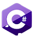

# **Jay Sanjay Karia 👨‍💻**

### ***Currently Learning Socket.IO 🔗***

---

### **"GOD OF TECH"**
### Technology Enthusiasts ⚙
### My goal is to "change the world" 🌎 and "develop india"
### Will create my own IT Company 🌐
### Exploring **Full Stack Web Development** (MERN Stack)
### **Want to collaborate with my?** Contact me at jay.sanjay.karia@gmail.com 📧

---

## **Languages I Know 💬**

---

<!-- ## **Technologies I Know 💻**

 -->
<!---
Jay-Karia/Jay-Karia is a ✨ special ✨ repository because its `README.md` (this file) appears on your GitHub profile.
You can click the Preview link to take a look at your changes.
--->
